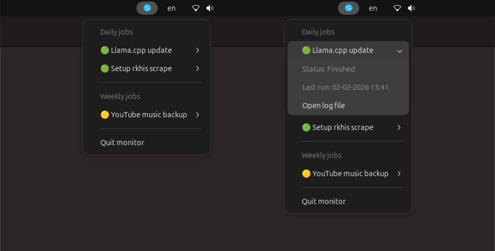

# Monitor cron jobs

[](https://www.python.org/)
[](./LICENSE)

This project is a monitoring suite for Ubuntu that automates the tracking of cron jobs, replacing the tedious process of manually navigating to log folders and opening files to check execution status. It provides a **system tray app** for instant visual feedback and a **CLI tool** for rapid status checks and log inspection.

This project uses a **calendar-based state machine** to verify that jobs ran within their designated schedule (e.g., *today* or *this week*). This prevents "silent failures" where a task stops running entirely, but the old successful log remains in place.



The system tray menu showing the daily job list (left) and the detailed status view for a specific task (right).

[https://github.com/user-attachments/assets/79dc0905-51a4-4a0b-aec1-95f51dd36ce3](https://github.com/user-attachments/assets/79dc0905-51a4-4a0b-aec1-95f51dd36ce3)

The CLI interface allows for rapid status checks and instant log inspection by job ID.

## Environment setup

### System dependencies

Since this project uses [GTK](https://www.gtk.org/) and `AppIndicators` for the system tray, the following system libraries are required:

```bash
# Ubuntu 24.04+
sudo apt install python3-gi python3-gi-cairo gir1.2-gtk-3.0 gir1.2-ayatanaappindicator3-0.1 libgirepository1.0-dev libcairo2-dev
```

Explanation of packages:

- `python3-gi`: Python bindings for GObject-based libraries (GTK).
- `gir1.2-gtk-3.0`: The GTK+ 3.0 graphics library.
- `gir1.2-ayatanaappindicator3-0.1`: A library and indicator to take menus from applications and place them in the panel.
- `libgirepository1.0-dev & libcairo2-dev`: Development headers required when building Python wrappers.

### Python environment

Create and activate a new Python environment using [conda](https://anaconda.org/anaconda/conda) or python's built-in [venv](https://docs.python.org/3/library/venv.html) module:

```bash
# Create a new conda environment and activate it:
conda create -n monitor_jobs python=3.12 -y
conda activate monitor_jobs

# If you prefer using venv:
python -m venv .venv
source .venv/bin/activate # On Windows use: .venv\Scripts\activate
```

Install the dependencies using `pip` or [uv](https://docs.astral.sh/uv/) (recommended).

```bash
# Using uv (Recommended)
uv sync

# Using pip
pip install -e .
```

## Configuration

### The wrapper script

> [!IMPORTANT]
> For the monitor to work, cron jobs **must** use a wrapper script. Do not run worker scripts directly from cron.

The wrapper handles permissions and writes the standardized state tags (`[JOB STARTED]`, `[JOB FAILED]`, `[JOB SUCCEEDED]`) that the monitor requires.

Save this template as `/etc/cron.daily/job-name` (must be executable and root-owned):

```bash
#!/bin/bash
set -e

USER_NAME="imad-saddik"
WORKER_SCRIPT="/home/$USER_NAME/Projects/MyProject/worker.sh"
LOG_DIR="/home/$USER_NAME/Projects/MyProject/logs"
LOG_FILE="$LOG_DIR/job_name_$(date +%Y-%m-%d).log"

mkdir -p "$LOG_DIR"
touch "$LOG_FILE"
chown -R $USER_NAME:$USER_NAME "$LOG_DIR"

# Redirect all output to log
exec >> "$LOG_FILE" 2>&1

echo "[JOB STARTED] $(date)"

# Error Trap (Catches crashes & non-zero exits)
handle_error() {
    echo "[JOB FAILED] $(date)"
    exit 1
}
trap 'handle_error' ERR

# Run the worker as the normal user
su - $USER_NAME -c "$WORKER_SCRIPT"

echo "[JOB SUCCEEDED] $(date)"
exit 0
```

### Registering jobs

Edit `jobs.json` to register tasks.

```json
{
    "jobs": [
        {
            "name": "Backup music",
            "frequency": "weekly",
            "log_pattern": "/home/imad/logs/backup_*.log",
            "process_pattern": "backup_music.sh"
        }
    ]
}
```

Configuration breakdown:

- **`frequency`**: How often the job should run. Accepted values are: `daily`, `weekly`, `monthly`.
- **`log_pattern`**: A glob pattern to find the log files. The monitor always reads the newest file matching this pattern.
- **`process_pattern`**: The name of the script or command (used by `pgrep -f`). If found, the status becomes **⏳ RUNNING** immediately.

## Usage

### CLI tool

The CLI tool (`cron_status.py`) checks job status from the terminal.

```bash
# Quick status check
uv run cron_status.py

# View the latest log for a specific job (by ID)
uv run cron_status.py 1
```

If you want to run the CLI tool from anywhere just by typing `cron_status`, follow these steps:

1. Create a new file in `/usr/local/bin/`:

    ```bash
    sudo nano /usr/local/bin/cron_status
    ```

2. Paste the following content (update the paths to match your system):

    ```bash
    #!/bin/bash

    $HOME/.local/bin/uv run $HOME/Projects/MonitorCronJobs/cron_status.py "$@"
    ```

3. Make the file executable:

    ```bash
    sudo chmod +x /usr/local/bin/cron_status
    ```

Now you can run `cron_status` from any terminal!

```bash
cron_status
cron_status 1
```

### System tray app

You can run the system tray app manually:

```bash
uv run tray_app.py
```

Or you can set it to start automatically on login.

1. Create a `.desktop` file:

   ```bash
   nano ~/.config/autostart/cron_status.desktop
   ```

2. Paste the following content (update the paths to match your system):

   ```ini
   [Desktop Entry]
   Type=Application
   Name=Cron Status
   Comment=Monitors the status of cron jobs
   Exec=/home/imad-saddik/.local/bin/uv run /home/imad-saddik/Projects/MonitorCronJobs/tray_app.py
   Path=/home/imad-saddik/Projects/MonitorCronJobs
   Icon=utilities-system-monitor
   Terminal=false
   Hidden=false
   NoDisplay=false
   X-GNOME-Autostart-enabled=true
   ```

> [!WARNING]
> Use absolute paths in the `.desktop` file (not `~`), as tilde expansion may not work reliably.

## Licence

This project is licensed under the MIT License. See the [LICENSE](./LICENSE) file for details.

## Contact

- **Email** – [simad3647@gmail.com](mailto:simad3647@gmail.com)
- **LinkedIn** – [Connect with me](https://www.linkedin.com/in/imadsaddik/)
